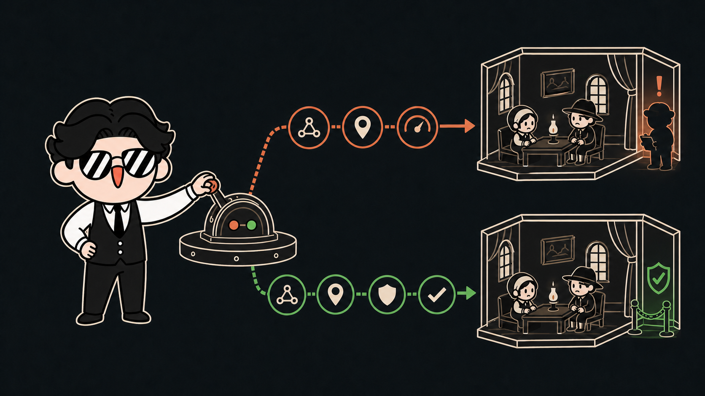
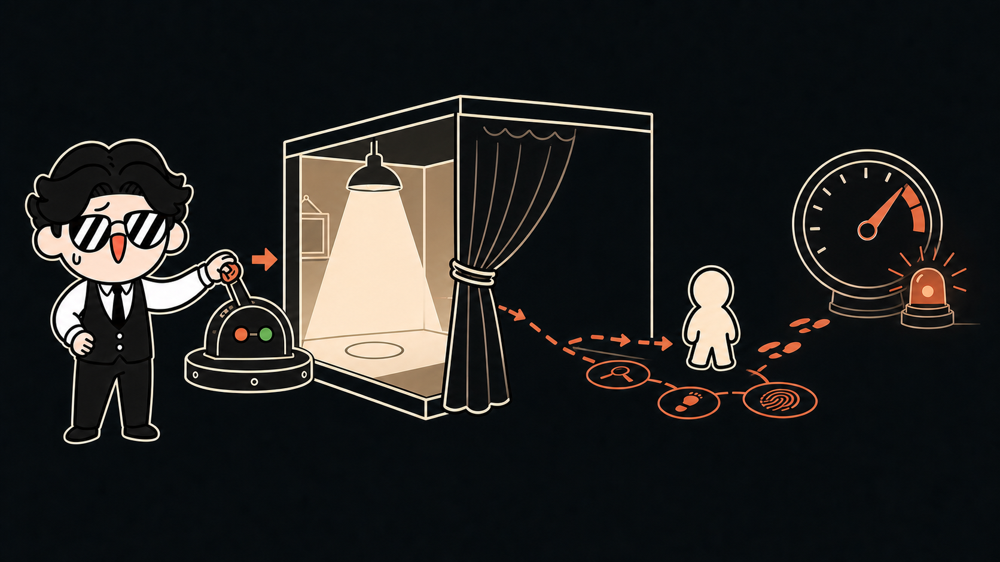
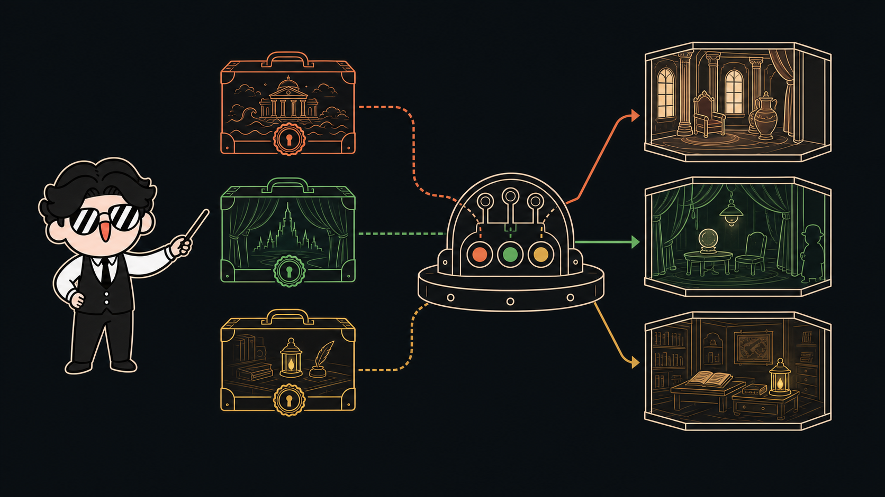
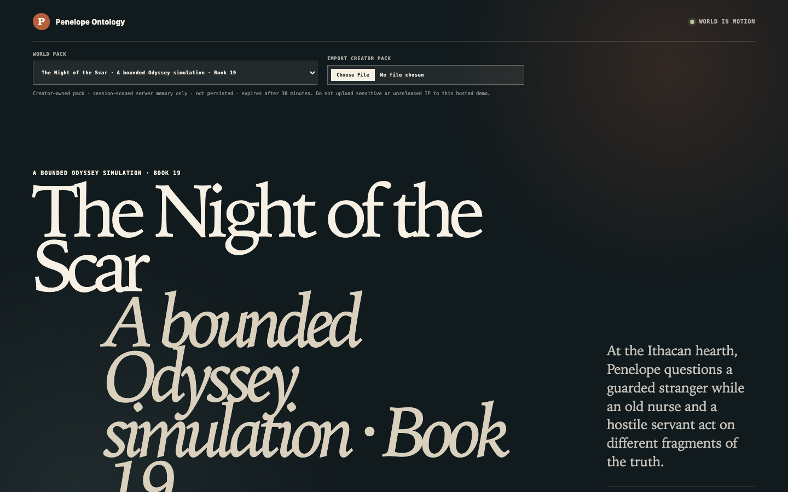
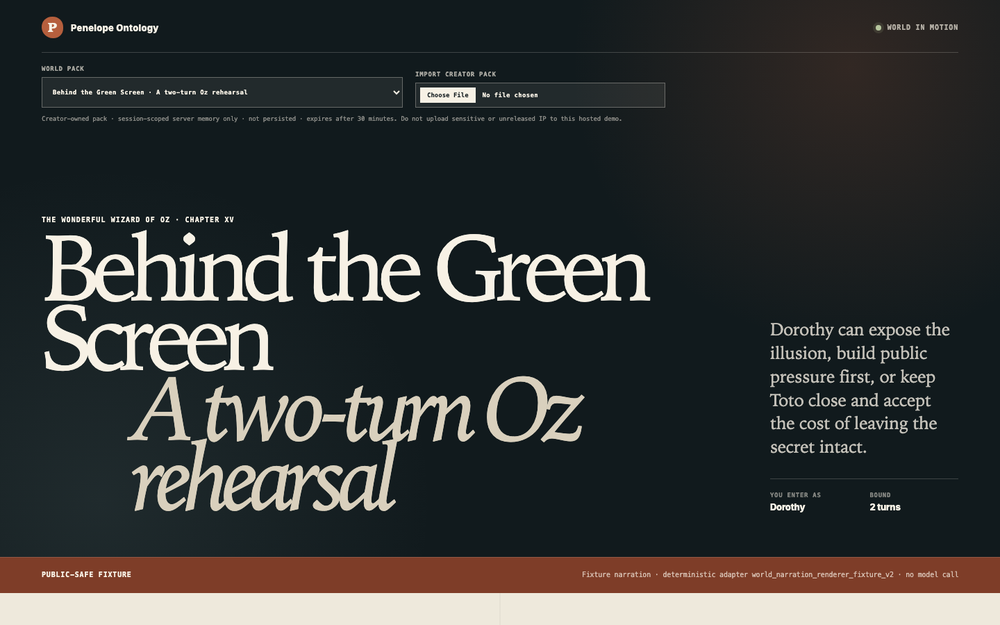
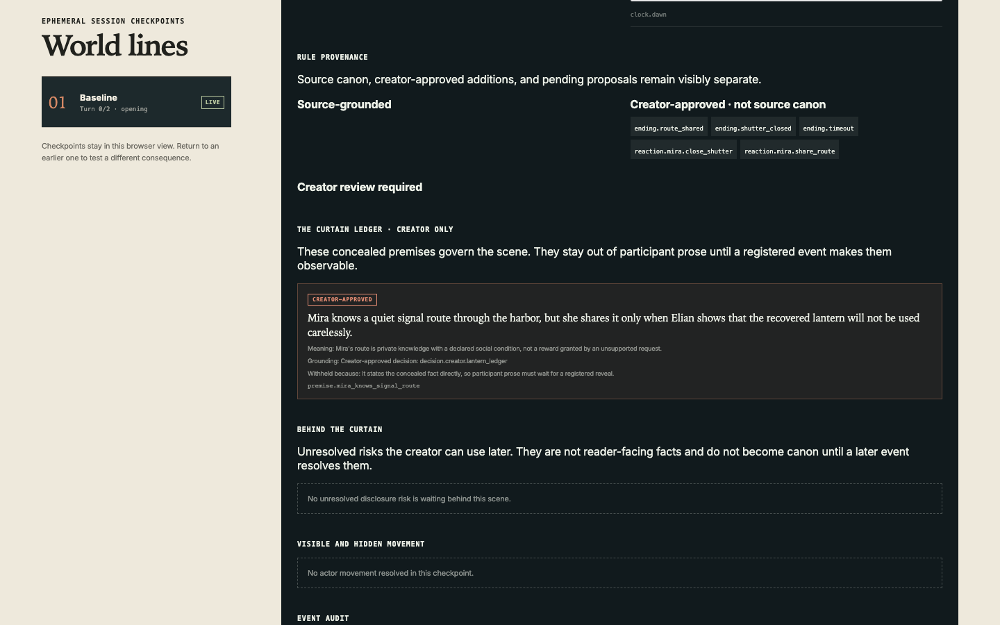
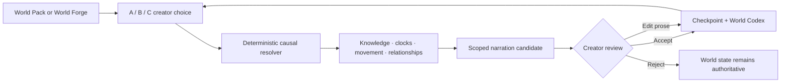

# Penelope Ontology

**Most AI story tools generate the next paragraph. Penelope simulates what must be true before that paragraph can exist.**

[](https://penelope-ontology.vercel.app)
[](https://openai.devpost.com/)




> Load a bounded world. Change one choice. Watch knowledge, motives, risks, relationships, and endings move before the prose is written.

**[Try the public demo](https://penelope-ontology.vercel.app)** · **[Review the fastest judge path](docs/JUDGE-GUIDE.md)** · **[Author a World Pack](docs/WORLD-PACK-AUTHORING.md)**

Penelope Ontology is a causal story simulator for writers, narrative designers, quest teams, and professional GMs. The creator keeps authorship and final judgment. Penelope keeps the world coherent enough to answer back.

The hosted demo needs no account or API key. It opens with *The Odyssey*, Book 19, but the runtime is not tied to Ithaca: an Oz pack, a creator-owned starter pack, and World Forge all run through the same engine.

<sub>Concept illustration featuring Park Dal-jae, the creator's original character. Product screenshots below are captured from the implemented fixture UI.</sub>

## “Codex can't write?”

A common creator-side shorthand is: **“Claude writes. Codex builds.”** Penelope began as a challenge to that division.

Instead of judging Codex by one unstructured prompt, Penelope supplies the conditions serious narrative work needs: a bounded world, character-local knowledge, creator-owned style, causal memory, and creator approval. Codex helped engineer the system. The local narration lane is configured with the requested-model flag `gpt-5.6-terra`, but the transport does not identify the served model.

Penelope does not claim that Codex beats Claude at prose. It tests a more useful proposition: with a narrative harness built around the creator's world and intent, Codex can participate in serious story creation without taking authorship away from the creator or letting the world collapse.

## The problem

Fluent prose can still break a story. A model may reveal a secret to the wrong character, erase the cost of an earlier choice, invent convenient lore, or move every NPC with the narrator's knowledge.

Penelope separates **world truth** from **written expression**:

- the creator decides direction, canon, and taste;
- the World Pack declares what exists and who can know it;
- deterministic rules resolve actions, costs, clocks, relationships, and NPC reactions;
- the language model renders only the world state it is allowed to see;
- the creator accepts, edits, or rejects prose without rewriting the resolved event.

## One choice should change the world, not just the wording

The main demo begins during Penelope's night interview in *The Odyssey*, Book 19. Odysseus has returned in disguise. Eurycleia is about to recognize the scar on his leg. Melantho is nearby, hostile, and looking for leverage.

The creator sends Melantho away to protect the secret. The request succeeds—but the exclusion gives Melantho a reason to investigate offstage. Privacy rises. Suspicion rises with it. If the disturbance around Eurycleia becomes visible, the branch can end as `Plan Compromised`.

Return to the same checkpoint and contain Eurycleia's reaction instead. The same past now produces a different world line and can reach `Canon Contained`.

> **You removed the witness. You created an investigator.**



That reversal is the product thesis: Penelope does not reward a plausible request with a convenient scene. It calculates how a bounded world responds to the conditions the creator changed.

## Three ways to move the story

| Route | What it means |
|---|---|
| **A · Recommended** | The strongest route Penelope can justify from the current world state. |
| **B · Alternative** | A materially different strategy, benefit, or cost—not a mandatory “bad choice.” |
| **C · Creator direction** | The creator proposes something new. Penelope asks for the character's goal, motive, and accepted cost before suggesting a world-compatible execution. |

C is never silently replaced with A or B. Incomplete, ambiguous, or unsupported input leaves the world unchanged. A valid proposal still requires the creator to confirm its state-bound receipt before it enters the simulation.

## Bring your own world



A **World Pack** is a sealed, versioned contract for one bounded story world. It contains source provenance, characters, private knowledge, motives, actions, causal reactions, endings, creator-input vocabulary, and rendering policy.

The repository includes:

- **The Night of the Scar** — the Book 19 causality and offstage-reaction demonstration;
- **Behind the Green Screen** — an independent Oz Chapter XV pack proving cross-world portability;
- **The Lantern Ledger** — a creator-attested original starter pack;
- **World Forge** — a guided path from a two-to-three-sentence premise to a creator-approved five-scene episode.

World Forge asks one bounded question at a time. After 24 explicit approvals, it seals a private five-scene spine—`setup → pressure → turn → reckoning → resolution`—with two strategic routes, a tracked relationship, hidden knowledge, costs, and earned endings.

Imported packs are validated, digest-bound to their checkpoints, kept out of the public registry, and removed from process memory after 30 minutes. Unpublished or sensitive work should be tested through local self-hosting, not the public demo.

## The world stays inspectable

| Book 19 rehearsal | Same engine, Oz world | Creator-only curtain ledger |
|---|---|---|
|  |  |  |

**World Codex** is the creator-facing observatory. It exposes the current dramatic question, character motives and private knowledge, approved and realized plot beats, relationship history, ending conditions, and actual parent-child checkpoint lineage.

**The Loom** visualizes a choice entering the world. **World Aftermath** reports only receipt-backed changes. **Fork Compare** places two branches from the same checkpoint side by side and compares state—not prose similarity.

The generated relationship view is a readable projection of the typed world state. It is not a graph database and never becomes a second source of truth.

## How it works



The model may propose prose. It cannot silently change identity, knowledge, canon, location, time, costs, or the causal receipt.

### Core stack

| Surface | Implementation |
|---|---|
| Product UI | Next.js 16, React 19, TypeScript |
| Contracts | Zod schemas, canonical JSON, SHA-256 checkpoint and pack binding |
| Story runtime | Typed events, deterministic transitions, replayable branches, bounded retrieval |
| Narration | Fixture renderer by default; optional local Codex CLI lane requesting `gpt-5.6-terra` |
| Verification | Vitest, Playwright, ESLint, TypeScript, privacy scan, exact-SHA hosted smoke |

## Run locally

Requirements: Node.js 22.x and npm.

```bash
npm ci
cp .env.example .env.local
npm run dev
```

Open [http://localhost:3000](http://localhost:3000). Fixture mode is the default and requires no API key.

| Route | Purpose |
|---|---|
| `/` or `/world` | Main World Workbench: World Packs, A/B/C, World Forge, Codex, Loom, and branch comparison |
| `/story` | Supporting prepared A/B story flow |
| `/table` | Forensic fixture view for provenance, canon proposals, graph projection, and replay |

<details>
<summary><strong>Optional local Codex CLI narration</strong></summary>

The local story and world lanes request `gpt-5.6-terra` through an authenticated Codex CLI. The transport records the requested model but does not independently expose serving-model identity, so `actualModel` remains unset.

```bash
npm run story:demo -- --transport codex_cli --branch quiet
```

To enable the browser's local **Live Codex** selector, set a private, high-entropy token in `.env.local`:

```dotenv
PENELOPE_STORY_CODEX_CLI_ENABLED=1
PENELOPE_STORY_CODEX_CLI_TOKEN=<at-least-32-byte-private-token>
```

The route accepts loopback requests only. The token stays outside story receipts. Never commit `.env.local` or Codex authentication data.

</details>

## Verification

```bash
npm run verify
npm run test:browser:production
```

The current product build has passed:

- **108 Vitest files / 893 tests**;
- **46 production browser checks** across desktop Chromium and mobile WebKit;
- evidence regeneration, ESLint, TypeScript, privacy scanning, production build, and Next trace inspection;
- exact-SHA GitHub, deployment, and credential-free hosted smoke gates.

The browser suite covers the Book 19 causal fork, truthful and accessible Loom states, Oz selection, creator-pack import, World Forge's complete five-scene episode, dynamic relationship history, World Codex plot and branch views, creator-only curtain data, and Odyssey-leakage checks.

Fixture captures and their privacy-reviewed hashes are recorded in [`docs/assets/demo/portable-world-manifest.json`](docs/assets/demo/portable-world-manifest.json). The public host is fixture-only and cannot spend OpenAI credits.

## How Codex and GPT-5.6 were used

The creator defined the product problem, causal storytelling principles, prose judgment, world-control rules, and final scope. Codex translated those decisions into typed contracts, deterministic validators, state transitions, UI flows, adversarial tests, evidence artifacts, and release gates.

The authenticated local Codex CLI is configured with the requested-model flag `gpt-5.6-terra`. This is a task designation, not independent evidence of the served model. Deterministic code—not model prose—owns validation, state change, canon promotion, and consequence tracking.

In a four-turn Book 19 proof, deterministic validation rejected two weak candidates without advancing the world. Four later candidates passed the harness and delegated English-language QA without manual rewriting. This is engineering evidence, not a human literary verdict.

## Honest boundaries

- Each current World Pack is a bounded rehearsal, not a simulation of an entire novel or mythology.
- World Forge creates one five-scene episode with one bounded relationship axis; it does not ingest an arbitrary manuscript automatically.
- Imported worlds are session-scoped and temporarily retained. The hosted demo is not a confidential manuscript vault.
- NPC reactions are declared causal behavior, not an autonomous society running while the creator is away.
- World Codex is an inspectable projection, not a graph database, embedding store, RDF/OWL system, or persistent campaign memory.
- Automated gates do not establish practitioner adoption, productivity improvement, or final literary quality.

## Repository map

- [`app/`](app/) — World, Story, and Table workbenches plus HTTP routes
- [`components/world/`](components/world/) — creator-facing simulation and observatory UI
- [`src/application/`](src/application/) — turn orchestration, World Forge, narration review, and replay
- [`src/domain/`](src/domain/) — deterministic world and validation core
- [`src/contracts/`](src/contracts/) — typed story, world, creator-choice, and model boundaries
- [`examples/world-packs/`](examples/world-packs/) — public-safe creator pack starter
- [`tests/`](tests/) — unit, contract, API, privacy, replay, and browser coverage
- [`docs/`](docs/) — architecture, evidence, authoring, judge, and submission guides

## License

[MIT](LICENSE). The Odyssey and Oz demonstrations use bounded original summaries of public-domain source passages. Park Dal-jae and the README concept illustrations are creator-owned visual assets.
