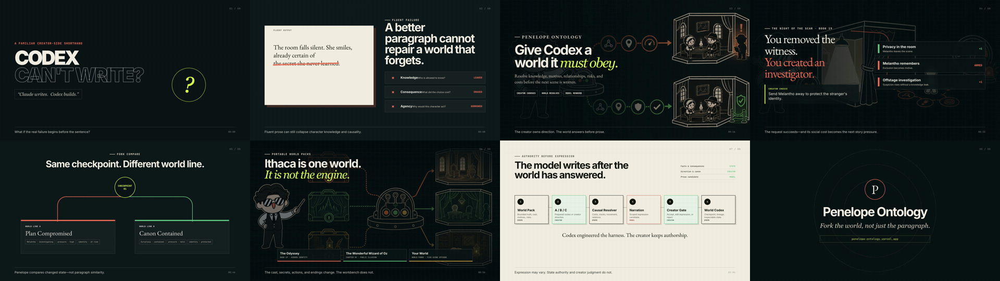

# Penelope presentation film

This folder contains the live-pitch script and an 82-second Hyperframes presentation film. It is separate from the under-three-minute product-operation demo.

**[Watch the public 2:42 product-operation demo](https://youtu.be/5oiEzLk8LWY)**



## Build

Requirements: Node.js 22+, FFmpeg.

```bash
npm ci
npm run doctor
npm run lint
npm run preview
npm run render:draft
```

The exact copy, narration WAV, and visual assets remain deterministic. `index.html` is the video source of truth. `live-pitch.html` is the presenter-controlled companion deck.

The temporary AIFF and rendered MP4 files stay untracked until creator review. The public-safe narration WAV and source visuals are reproducible inputs; the image assets are copies of the repository's approved README illustrations and fixture screenshots.
